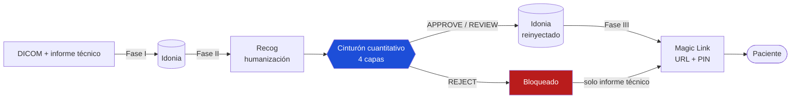

# Cinturón de Fidelidad Clínica

**Un control de calidad cuantitativo para informes radiológicos dirigidos al paciente**

[](https://github.com/USER/idonia-recog-orchestrator/actions/workflows/ci.yml)
[](LICENSE)
[](https://www.python.org/downloads/)
[](data/reports/README.md)

*[Read this in English](README.md) — la versión inglesa es la canónica; esta es
una traducción de cortesía. La documentación técnica de `docs/` está en inglés.*

---

## Resumen

Traducir un informe radiológico a lenguaje comprensible para el paciente no es un
problema de estilo, sino de seguridad clínica: una versión que convierte *«rotura
completa del ligamento cruzado anterior»* en *«el ligamento está algo afectado»*
es más legible y materialmente más peligrosa. Este proyecto interpone un
**cinturón cuantitativo de fidelidad** entre un servicio de humanización con IA y
la entrega al paciente: un gate de cuatro capas que mide legibilidad, cobertura
clínica, recall de entidades y fidelidad factual, y decide por votación si el
informe humanizado es lo bastante fiel para entregárselo al paciente. El gate es
real: si rechaza, el informe no se reinyecta en el sistema de imagen. La
aportación metodológica central es la distinción operativa entre **simplificación
apropiada** (se elimina la jerga, se preserva la gravedad) y **atenuación de
gravedad** (se minimiza la gravedad de forma que podría cambiar una decisión
clínica), y la demostración de que los métodos léxicos no pueden trazarla
mientras que un LLM-as-a-judge con fundamentación explícita sí. El trabajo
publica además los fallos de su propio validador: el cinturón léxico rechaza un
informe clínicamente fiel producido por la API de producción, y un NER
transformer *redujo* el recall de entidades del 56 % al 8,6 % frente a un
diccionario curado a mano.

Desarrollado para el hackathon IABiomed 2026 (Universidad de León), conectando
dos APIs sanitarias españolas reales: **Idonia** (middleware DICOM y entrega por
Magic Link) y **Recog** (NLP médico en español).

## El problema

| | Definición | Ejemplo | Veredicto |
|---|---|---|---|
| **Simplificación apropiada** | Se elimina la jerga, se preserva la gravedad clínica | *«condromalacia grado II»* → *«desgaste del cartílago»* | Es el objetivo |
| **Atenuación de gravedad** | Se minimiza la gravedad de forma que podría cambiar una decisión | *«rotura completa»* → *«pequeña fisura que se cura sola»* | Es el riesgo |

El criterio operativo que se aplica en todo el cinturón:

> ¿Un médico que leyera el informe humanizado tomaría la misma decisión
> terapéutica que con el original?

Un sistema que no sabe distinguirlos tiene dos opciones, ambas malas: rechazar
toda reformulación, o aceptar las peligrosas. Construir uno que sí sepa es la
aportación.

## Arquitectura



Un informe rechazado sigue generando Magic Link, pero solo con el informe
técnico. El paciente nunca se queda sin nada; se le protege de una humanización
que tergiversa la gravedad.

### El cinturón

| Capa | Pregunta | Implementación | Vota |
|---|---|---|---|
| 0 — Legibilidad | ¿El paciente lo entiende? (INFLESZ ≥ 55) | `readability.py` | No — informativa |
| 1 — Checklist clínico | ¿Están los hallazgos, sin atenuar la gravedad? | `clinical_checklist.py` | Sí |
| 2 — NER recall | ¿Se preservan las entidades clínicas? (≥ 0,65) | `clinical_ner.py` | Sí |
| 3 — Fidelidad | ¿No afirma nada falso? | `clinical_nli.py` / `clinical_llm_judge.py` | Sí |

**3/3 → APPROVE · 2/3 → REVIEW · ≤1/3 → REJECT**

Las capas 1 y 2 garantizan **cobertura** — que no se omite nada. La capa 3 mide
lo complementario — que lo que se dice no es **falso**. No son redundantes.

La capa 3 tiene tres modos intercambiables por inyección de dependencias:
`entailment` (léxico, sin dependencias ML, el default offline), `contradiction`
(mDeBERTa-v3, el planteamiento metodológicamente correcto) y `llm_judge` (Gemini,
el más preciso). Detalle en [docs/methodology.md](docs/methodology.md).

## Instalación

```bash
pip install -e .                  # núcleo + demo
pip install -e ".[dev]"           # + suite de tests
pip install -e ".[api]"           # + servidor FastAPI
pip install -e ".[ml]"            # + backends semánticos (BSC NER, mDeBERTa), ~1 GB
pip install -e ".[live]"          # + APIs reales de Idonia y Recog
```

Python 3.10+. Para reproducir exactamente las cifras publicadas, usa
[`requirements-lock.txt`](requirements-lock.txt).

## Uso

```bash
python examples/run_demo.py       # demo E2E, sin red ni credenciales
pytest -q                         # 30 tests, sin red
uvicorn idonia_recog.api.main:app --reload    # API HTTP → localhost:8000/docs
```

El demo ejecuta dos flujos sobre el caso de referencia: uno con un informe
humanizado fiel y otro con atenuaciones clínicas sembradas. Bloquea el segundo.

Para los scripts de evaluación —backends semánticos, juez LLM, APIs reales— ver
[scripts/README.md](scripts/README.md). Copia `.env.example` a `.env` para todo
lo que necesite credenciales.

## Resultados

Reproducidos el 2026-08-12 ejecutando el código. Detalle completo, incluido lo
que **no** se pudo reproducir y por qué, en [docs/results.md](docs/results.md).

### Cinturón en modo léxico (default offline)

| Informe | Decisión | Capa 1 | Capa 2 NER | Capa 3 | INFLESZ |
|---|---|---|---|---|---|
| Gold (humanización de referencia) | **APPROVE** (3/3) | pasa | 80,0 % | 38,1 % | 62,5 |
| Adversarial (atenuaciones sembradas) | **REJECT** (1/3) | falla | 48,0 % | 36,4 % | 57,9 |
| Texto idéntico (control) | **APPROVE** (3/3) | pasa | 100,0 % | 100,0 % | 38,5 |

### Cinturón en modo LLM-as-a-Judge

*Medición de junio de 2026; no reejecutada (requiere API key y llamadas facturables).*

| Informe | Preservados | Simplificados | Omitidos | Atenuados | Decisión |
|---|---|---|---|---|---|
| Recog producción | 2 | 5 | 0 | 0 | **PASS** |
| Gold | 3 | 4 | 0 | 0 | **PASS** |
| Adversarial | 2 | 1 | 1 | 3 | **FAIL** |

El juez detectó los cuatro ataques sembrados con confianza 1.0 y no produjo ni un
falso positivo sobre los informes válidos.

## Limitaciones y resultados negativos

Se exponen en primer plano a propósito. Detectar los límites del propio validador
es el contenido del uso crítico de la IA, no una nota al pie.

**El cinturón léxico rechaza un informe clínicamente fiel.** El output de
producción de Recog es el informe más legible de todos los medidos (INFLESZ 65,3)
y el juez LLM confirma que es fiel — y aun así el cinturón léxico lo rechaza (NER
64,0 %, entailment 28,6 %). Dos causas distintas: patrones regex mal calibrados,
que son bugs reales y se corrigieron, y la incapacidad inherente del matching de
cadenas para ver que *«lesión por golpe en los huesos»* significa *«edema óseo en
patrón pivot-shift»*, que no se arregla con más regex. La arquitectura de doble
backend anticipaba ese techo; medirlo es su justificación.

**Un NER transformer empeoró la capa 2.** Sustituir el diccionario curado a mano
por un modelo NER clínico hundió el recall del 56 % al 8,6 %. El modelo extrae
spans literales, que rara vez coinciden con cómo un informe humanizado redacta el
mismo concepto. El problema real es entity linking (SNOMED-CT), no
reconocimiento. El diccionario curado subió el recall al 64 % con coste de
implementación cero: la solución humilde ganó a la sofisticada porque resolvía el
problema correcto.

**Un resultado de este repositorio no es reproducible.** El output de producción
de Recog usado en las mediciones no se conservó, de modo que tres scripts de
evaluación no pueden ejecutarse hasta regenerarlo. Ver
[data/reports/README.md](data/reports/README.md).

**El modo live de Idonia nunca se validó de extremo a extremo.** La firma JWT y
el flujo de Magic Link están implementados a partir del Swagger de staging y
ejercitados contra él, pero la validación completa dependía de la activación por
parte del equipo de soporte de Idonia.

**El dataset de evaluación es un único caso sintético.** Tres informes, siete
hallazgos. Es una sonda dirigida a exponer una distinción concreta, no un
benchmark, y no se reclama generalidad estadística.

## Estructura del repositorio

```
src/idonia_recog/
  domain/          modelos Pydantic inmutables
  clients/         adaptadores Idonia y Recog — stub (offline) y live
  evaluation/      el cinturón cuantitativo, cuatro capas
  orchestration/   votación de capas + las tres fases del pipeline
  api/             FastAPI: POST /ingest, /humanize, /deliver
data/reports/      dataset de evaluación (sintético) + data card
docs/              metodología, resultados, notas de ingeniería, referencias
examples/          demo E2E
scripts/           evaluación y experimentos contra APIs reales
tests/             30 tests offline
```

## Cómo citar

Ver [CITATION.cff](CITATION.cff).

## Licencia

Código bajo [licencia MIT](LICENSE). El dataset de evaluación en `data/` se
publica por separado bajo [CC BY 4.0](data/reports/README.md).

## Agradecimientos

Desarrollado para el **hackathon IABiomed 2026** de la Universidad de León.
Gracias a los equipos de **Idonia** y **Recog** por el acceso a las APIs y el
soporte durante el desarrollo. El caso clínico es sintético; las instituciones
que aparecen en él no participaron en el proyecto.
