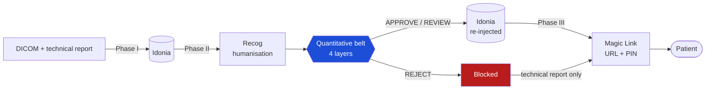

# Clinical Fidelity Belt

**A quantitative fidelity gate for patient-facing radiology reports**

[](https://github.com/hugoomez/clinical-fidelity-belt/actions/workflows/ci.yml)
[](LICENSE)
[](https://www.python.org/downloads/)
[](data/reports/README.md)

*[Léeme en español](README.es.md)*

---

## Abstract

Translating a radiology report into patient-comprehensible language is not a
style problem but a clinical safety one: a rendering that turns *"complete tear
of the anterior cruciate ligament"* into *"the ligament is somewhat affected"* is
more readable and materially more dangerous. This project interposes a
**quantitative fidelity belt** between an AI humanisation service and patient
delivery — a four-layer gate measuring readability, clinical coverage, entity
recall and factual fidelity, which by majority vote decides whether a humanised
report is faithful enough to be given to a patient. The gate is real: a rejected
report is not re-injected into the imaging system. The central methodological
contribution is the operational distinction between **appropriate
simplification** (jargon removed, severity preserved) and **severity attenuation**
(severity minimised such that a clinical decision could change), and the
demonstration that lexical methods cannot draw it while an LLM-as-a-judge with
explicit grounding can. The work also reports its own validator's failures: the
lexical belt rejects a clinically faithful report produced by the production API,
and a transformer NER *reduced* entity recall from 56% to 8.6% relative to a
hand-curated dictionary.

Built for the IABiomed 2026 hackathon (Universidad de León), connecting two real
Spanish healthcare APIs: **Idonia** (DICOM middleware and Magic Link delivery) and
**Recog** (Spanish medical NLP).

## The problem

| | Definition | Example | Verdict |
|---|---|---|---|
| **Appropriate simplification** | Jargon removed, clinical severity preserved | *"grade II chondromalacia"* → *"cartilage wear"* | The goal |
| **Severity attenuation** | Severity minimised such that a decision could change | *"complete tear"* → *"small fissure, heals on its own"* | The risk |

The operative criterion, applied throughout:

> Would a clinician reading the humanised report reach the same therapeutic
> decision as with the original?

A system that cannot tell these apart has two options, both bad: reject every
rewording, or accept dangerous ones. Building one that can is the contribution.

## Architecture



A rejected report still produces a Magic Link, carrying the technical report
alone. The patient is never left with nothing; they are protected from a
humanisation that misrepresents severity.

### The belt

| Layer | Question | Implementation | Votes |
|---|---|---|---|
| 0 — Readability | Can the patient read it? (INFLESZ ≥ 55) | `readability.py` | No — informative |
| 1 — Clinical checklist | Are the findings present, severity intact? | `clinical_checklist.py` | Yes |
| 2 — NER recall | Are the clinical entities preserved? (≥ 0.65) | `clinical_ner.py` | Yes |
| 3 — Fidelity | Does it assert anything false? | `clinical_nli.py` / `clinical_llm_judge.py` | Yes |

**3/3 → APPROVE · 2/3 → REVIEW · ≤1/3 → REJECT**

Layers 1 and 2 guarantee **coverage** — nothing omitted. Layer 3 measures the
complement — nothing **false**. They are not redundant.

Layer 3 has three interchangeable modes selected by dependency injection:
`entailment` (lexical, no ML dependencies, the offline default), `contradiction`
(mDeBERTa-v3, the methodologically correct framing) and `llm_judge` (Gemini, the
most precise). Full detail in [docs/methodology.md](docs/methodology.md).

## Installation

```bash
pip install -e .                  # core + demo
pip install -e ".[dev]"           # + test suite
pip install -e ".[api]"           # + FastAPI server
pip install -e ".[ml]"            # + semantic backends (BSC NER, mDeBERTa), ~1 GB
pip install -e ".[live]"          # + real Idonia and Recog APIs
```

Python 3.10+. To reproduce the published figures exactly, use
[`requirements-lock.txt`](requirements-lock.txt).

## Usage

```bash
python examples/run_demo.py       # end-to-end demo, no network, no credentials
pytest -q                         # 30 tests, fully offline
uvicorn idonia_recog.api.main:app --reload    # HTTP API → localhost:8000/docs
```

The demo runs two flows over the reference case: one with a faithful humanised
report, one with seeded clinical attenuations. It blocks the second.

For the evaluation scripts — semantic backends, LLM judge, live APIs — see
[scripts/README.md](scripts/README.md). Copy `.env.example` to `.env` for
anything that needs credentials.

## Results

Reproduced 2026-08-12 by running the code. Full detail, including what could
*not* be reproduced and why, in [docs/results.md](docs/results.md).

### Belt in lexical mode (offline default)

| Report | Decision | Layer 1 | Layer 2 NER | Layer 3 | INFLESZ |
|---|---|---|---|---|---|
| Gold (reference humanisation) | **APPROVE** (3/3) | pass | 80.0 % | 38.1 % | 62.5 |
| Adversarial (seeded attenuations) | **REJECT** (1/3) | fail | 48.0 % | 36.4 % | 57.9 |
| Identical text (control) | **APPROVE** (3/3) | pass | 100.0 % | 100.0 % | 38.5 |

### Belt in LLM-as-a-Judge mode

*June 2026 measurement; not re-run (requires an API key and billable calls).*

| Report | Preserved | Simplified | Omitted | Attenuated | Decision |
|---|---|---|---|---|---|
| Recog production | 2 | 5 | 0 | 0 | **PASS** |
| Gold | 3 | 4 | 0 | 0 | **PASS** |
| Adversarial | 2 | 1 | 1 | 3 | **FAIL** |

The judge caught all four seeded attacks with confidence 1.0 and produced no
false positives on the valid reports.

## Limitations and negative results

These are stated prominently on purpose. Detecting the limits of one's own
validator is the substance of critical AI use, not a footnote to it.

**The lexical belt rejects a clinically faithful report.** Recog's production
output is the most readable report measured (INFLESZ 65.3) and is confirmed
faithful by the LLM judge — and the lexical belt rejects it (NER 64.0%,
entailment 28.6%). Two distinct causes: miscalibrated regex patterns, which are
real bugs and were fixed, and the inherent inability of string matching to see
that *"injury from a blow to the bones"* means *"bone marrow oedema in a
pivot-shift pattern"*, which no amount of regex fixes. The dual-backend design
anticipated this ceiling; measuring it is the design's justification.

**A transformer NER made layer 2 worse.** Swapping the hand-curated dictionary
for a clinical NER model dropped recall from 56% to 8.6%. The model extracts
literal spans, which rarely coincide with how a humanised report words the same
concept. The real problem is entity linking (SNOMED-CT), not recognition. The
hand-curated dictionary raised recall to 64% at zero implementation cost — the
humble solution beat the sophisticated one because it solved the right problem.

**One result in this repository is not reproducible.** The production Recog
output used in the measurements above was not preserved, so three evaluation
scripts cannot run until it is regenerated. See
[data/reports/README.md](data/reports/README.md).

**Idonia live mode was never validated end to end.** JWT signing and the Magic
Link flow are implemented from the staging Swagger and exercised against it, but
full validation depended on activation by Idonia's support team.

**The evaluation dataset is one synthetic case.** Three reports, seven findings.
It is a targeted probe designed to expose a specific distinction, not a
benchmark, and no claim of statistical generality is made.

## Repository structure

```
src/idonia_recog/
  domain/          immutable Pydantic models
  clients/         Idonia and Recog adapters — stub (offline) and live
  evaluation/      the quantitative belt, four layers
  orchestration/   layer voting + the three pipeline phases
  api/             FastAPI: POST /ingest, /humanize, /deliver
data/reports/      evaluation dataset (synthetic) + data card
docs/              methodology, results, engineering notes, references
examples/          end-to-end demo
scripts/           evaluation and live-API experiments
tests/             30 offline tests
```

## Documentation

| Document | Contents |
|---|---|
| [docs/methodology.md](docs/methodology.md) | The belt, the four layers, voting policy, thresholds |
| [docs/results.md](docs/results.md) | Experimental results, reproduced and marked where not |
| [docs/engineering-notes.md](docs/engineering-notes.md) | Problems hit and how they were resolved |
| [docs/architecture.md](docs/architecture.md) | Diagrams and design decisions |
| [docs/references.md](docs/references.md) | Bibliography and regulatory framework |
| [docs/ai-usage.md](docs/ai-usage.md) | AI usage disclosure |
| [docs/Memoria_Tecnica_Idonia_Recog.pdf](docs/Memoria_Tecnica_Idonia_Recog.pdf) | Original hackathon submission (Spanish) |

## Citation

```bibtex
@software{clinical_fidelity_belt_2026,
  author  = {Hugo G\'omez},
  title   = {Clinical Fidelity Belt: a quantitative fidelity gate
             for patient-facing radiology reports},
  year    = {2026},
  version = {1.0.0},
  url     = {https://github.com/hugoomez/clinical-fidelity-belt}
}
```

See [CITATION.cff](CITATION.cff).

## License

Code under the [MIT License](LICENSE). The evaluation dataset in `data/` is
released separately under [CC BY 4.0](data/reports/README.md).

**This is research code, not a medical device.** It has not been clinically
validated and must not be used to generate documents delivered to real patients
without independent professional review. See [NOTICE.md](NOTICE.md).

## Acknowledgements

Developed for the **IABiomed 2026 hackathon** at the Universidad de León.
Thanks to the **Idonia** and **Recog** teams for API access and support during
development. The clinical case is synthetic; the institutions named in it had no
involvement in this project.
