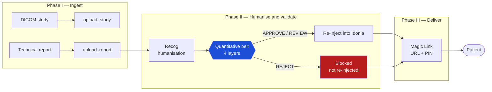
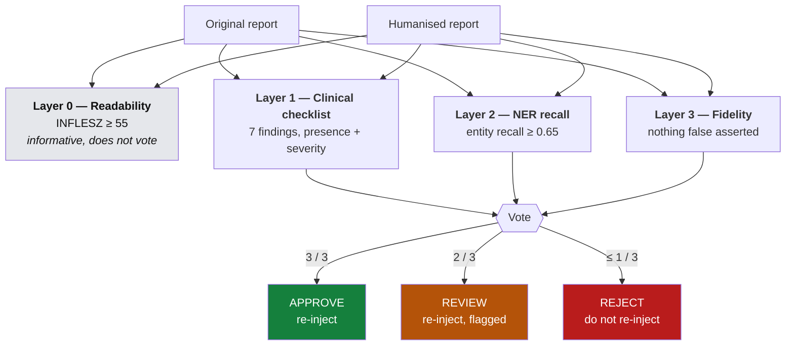
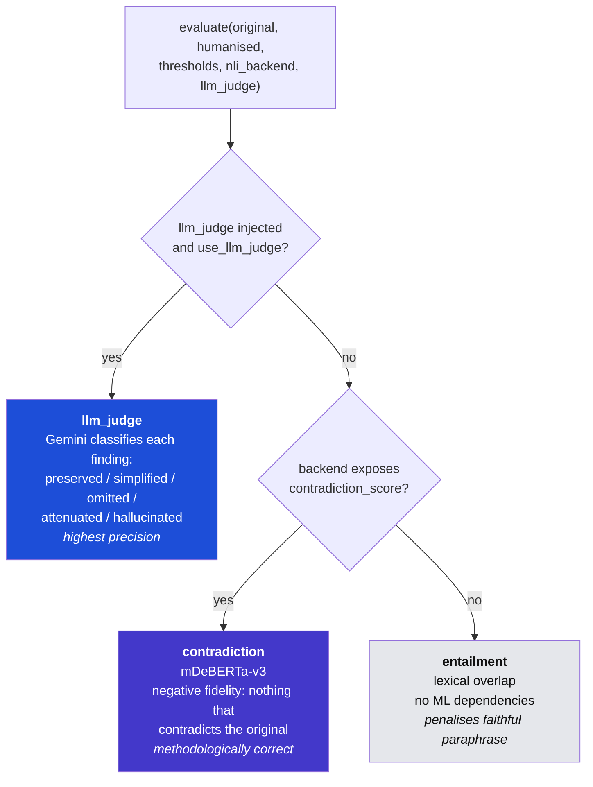

# Architecture

## Module map

| Module | Responsibility |
|---|---|
| `domain/` | Immutable Pydantic models (`Patient`, `StudyRef`, `MagicLink`, `SafetyVerdict`…). The common currency of the pipeline |
| `clients/` | Adapters for Idonia and Recog. Each has a stub (offline) and a live implementation satisfying the same protocol |
| `evaluation/` | The quantitative belt: four evaluation layers, independently testable |
| `orchestration/` | `safety_belt` (layer voting) and `use_cases` (the three pipeline phases) |
| `api/` | FastAPI application: `POST /ingest`, `/humanize`, `/deliver` |

## Pipeline

A rejected report still produces a Magic Link — carrying the technical report
alone. The patient is never left with nothing; they are protected from a
humanisation that misrepresents severity.

## The belt

Layers 1 and 2 guarantee **coverage** — that nothing is omitted. Layer 3 measures
the complement — that what is said is not **false**. They are not redundant.

## Layer 3, three interchangeable modes

The active mode is recorded in `SafetyVerdict.nli_mode` and printed in the
verdict summary, so a result can never be read without knowing which backend
produced it.

Switching modes is dependency injection, not configuration: no branch in the
business logic knows which backend it is talking to.

## Design decisions

**Interchangeable stub/live clients.** Both satisfy the same protocol
(`clients/base.py`) and are injected by constructor. Moving from the offline demo
to the real APIs is one line in `api/main.py`, with zero changes to business
logic. This is what lets the complete system be demonstrated without depending on
third-party availability — and what lets the test suite run hermetically.

**Immutable models (Pydantic `frozen`).** Once Idonia returns a `StudyRef`,
nothing can mutate it. This makes the pipeline state easy to reason about and is
the basis of a clean audit trail; the demo prints the full trace of calls.

**Dual backend per layer.** Each semantic layer has a lexical backend (no
downloads, runs anywhere) and an advanced one (transformer or LLM). The lexical
one is the demo default; the advanced one is for production. Again, one line.

**The belt is a gate, not a report.** `HumanizeReport` does not re-inject a
rejected humanisation. A validator that only logs its verdict protects nobody.
